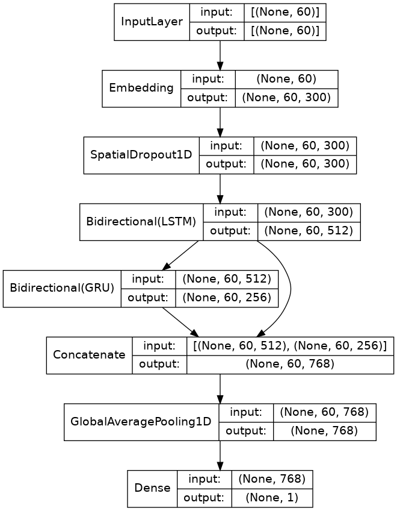

# Quora-insincere-questions-challenge

Quick summary
============

Quora insincere question challenge is the task to detect toxic content in Quora platform.

This notebook is my attempt of using a simple Bidirectional LSTM and an stacked LSTM and GRU architecture shown below.

The best result I got so far
|                    | Private score | Public score |
|--------------------|---------------|--------------|
| Bidirectional LSTM | 0.61875       | 0.61197      |
| Stacked LSTM&GRU   | 0.63030       | 0.61342      |

